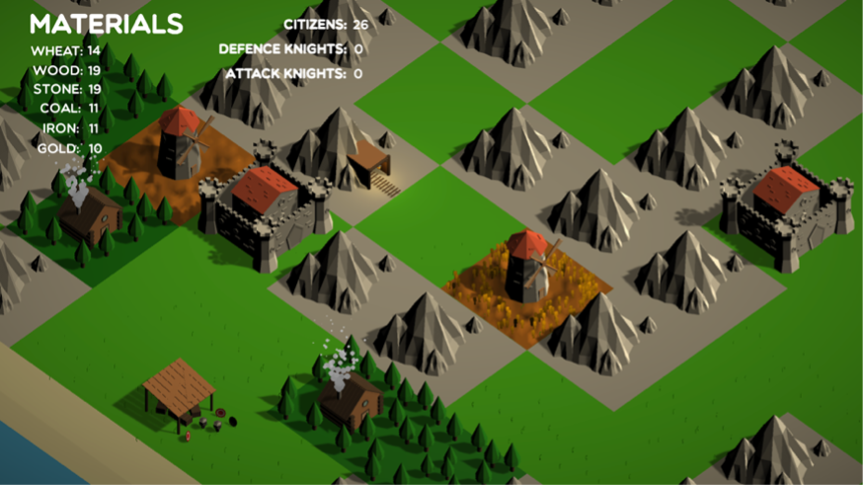
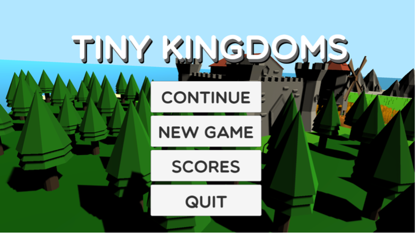
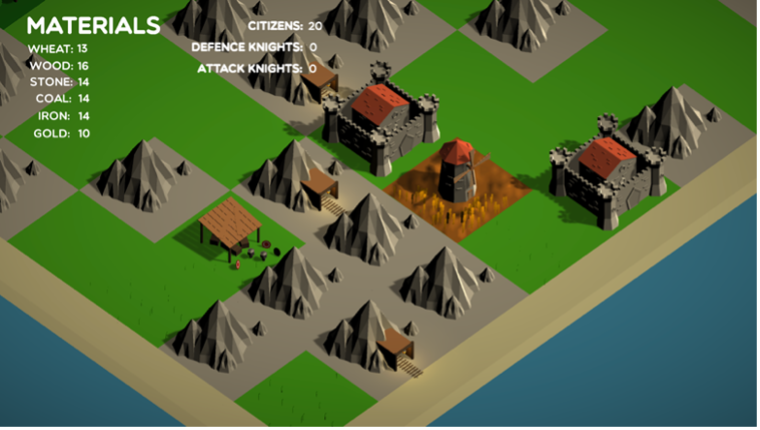

# Tiny Kingdoms

Tiny Kingdoms je moj maturitetni izdelek ob zaključku Elektrotehniško-računalniške strokovne šole in gimnazije Ljubljana.

## Opis igre

Tiny Kingdoms je igra, postavljena v srednji vek. Igralec ima pogled na igralno površino iz izometrične perspektive in se lahko premika v vse smeri. Igralna plošča je naključno generirana in sestavljena iz manjših ploščic, ki predstavljajo različne vrste pokrajin. Le-te so travnik, gozd, gorovje in obala. Prve tri se generirajo v večjih skupinah, obala pa jih obdaja. Igralec v tej igri v osnovi gradi svoje kraljestvo. Na začetku igre ima možnost postaviti svoj grad na enega od prostih travnikov na igralni površini. Ko je le-ta postavljen, se igra začne. Igralcu so na razpolago različne surovine. To so žito, les, kamen, oglje, železo in zlato. Na začetku začne z naključno količino surovin. Z njimi lahko postavlja zgradbe. To so kmetija, rudnik, koča, barake in pristanišče. Vsako od njih, razen pristanišča, pa lahko tudi nadgradi za hitrejšo proizvodnjo materialov. Kmetija prinaša žito, koča les, rudnik pa kamen, oglje, železo in zlato. Na pristanišču pristanejo trgovske ladje, s katerimi lahko menjamo surovine. Barake izurijo meščane v vojake, ki se lahko pridružijo obrambni ali napadalni vojski. Na začetku igralec začne z določenim številom meščanov, ki pričnejo umirati, če jih pravočasno ne nahrani. Če nadgradi kraljestvo, se poveča število meščanov, hkrati pa se tudi razširi površina, na kateri lahko postavlja zgradbe.

Na igralni površini se naključno generirajo tudi druga kraljestva, ki imajo naključno število zgradb in naključno količino surovin. Vsakemu tujemu kraljestvu je dodeljen tudi status odnosa z našim kraljestvom. Ta je lahko od -50 do 50. Pod 0 pomeni, da je kraljestvo agresivno proti nam, 0 pomeni, da je nevtralno, nad 0 pa pomeni, da je z nami v prijateljskem odnosu. Če je proti nam agresivno, nas lahko v katerem koli trenutku napade, če pa je v prijateljskem odnosu, pa lahko z njim trgujemo. Vsako kraljestvo lahko podkupimo z zlatom in mu tako povišamo status odnosa.

Ko je neko kraljestvo napadeno, se proti njemu začne pomikati napadalna vojska. Le-to se bo skušalo braniti s svojo obrambno vojsko. Napadalci bodo šli od zgradbe do zgradbe in jih rušili ter tako pridobivali surovine. Če je moč obrambne vojske dovolj velika, bo pravočasno ustavila napadalno vojsko. Igralec igro izgubi, če mu nekdo drug uniči njegovo kraljestvo.

## Uporabljena programska oprema
- Unity 3D
- Visual Studio
- Blender
- GIMP

Za bolj podroben opis igre in postopka implementacije si oglejte [poročilo (Tiny Kingdoms.pdf)](Tiny%20Kingdoms.pdf).

## Končna verzija in izvorna koda
Če želite igro preiskusiti, boste v mapi `build/` našli verziji za Windows in MacOS. Če želite pogledati izvorno kodo, pa odprite datoteko `source/` (Unity3D projekt).

## Slike
Sledi nekaj slik iz igre.

